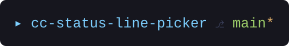
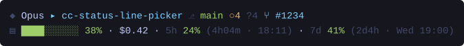
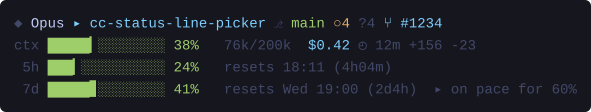
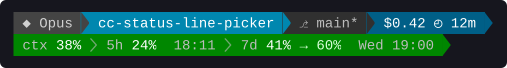

# cc-status-line-picker

Claude Code renders exactly one `statusLine`, and you configure it by hand-editing
`settings.json` with a command string that has to survive your shell, your OS and your Node
installation. This plugin ships ten status lines and a picker that swaps between them. It
validates `settings.json` before touching it and backs up every version it replaces.

## Install

```
/plugin marketplace add Priotts/cc-status-line-picker
/plugin install cc-status-line-picker@cc-status-line-picker
```

Node 18 or newer on your PATH. Nothing else: no `jq`, no runtime dependencies, no build
step, because `dist/` ships built. git is optional. Without it the branch section is
omitted and nothing else changes.

Restart Claude Code, then run `/statusline-pick`. Plain language reaches the same skill:
*"give me a status line with git and my session cost"*, *"put my old one back"*, *"get rid
of the status bar"*.

`/statusline-preview` renders everything and writes nothing.

Restart again after activating. Claude Code reads the command once, when the session
starts, so a freshly installed style will not appear in the session you installed it from.

## The gallery

Real output, from running each style against `examples/session.json` in this repository.
That is why the directory and branch are the ones you see. Colour is stripped below. Live,
percentages turn amber at 70 and red at 90.

### minimal


`compact` imports no ANSI helper at all, so it emits zero escape codes whatever your
terminal or `NO_COLOR` say. Neither style calls git. They are the two cheapest to run.

### git




`branch` gives you one thing: where you are, plus a yellow `*` when the tree is dirty. That
asterisk is the entirety of what it reports about your working tree.

`full` counts instead. `↑↓` for divergence from upstream, `●` staged, `○` modified, `?`
untracked, and the literal word `clean` when there is nothing to report. Then the worktree
name, then the pull request with its review state coloured by outcome. PR data arrives in
Claude Code's payload; the style never shells out to `gh` and never touches the network.

### usage


`tokens` reads the real window size from the payload, so a 1M-context model shows `/1M`
instead of pretending everything is 200k. It also flags `>200k` when Claude Code sets
`exceeds_200k_tokens`, a fixed threshold unrelated to your actual window.

`cost` gives each rate-limit window both a countdown and a wall-clock time. The countdown
answers how long you have, the clock answers when you can start again. Set
`showResetTime: false` to drop the clock half.

`pace` is the projection without any bars. Read `41%→61%` as "at 41, heading for 61". It is
the only style that surfaces `effort.level`, the `high` after `Opus`, and the only one
where model, effort and fast mode share a single segment. They read as one question, "what
am I talking to", so they get one answer. Everything except the numbers is grey.

### fancy



Identity and repository state on top, consumption underneath. Each line truncates
independently, so a narrow terminal loses the tail of a row rather than wrapping it.



Context and both rate-limit windows on one scale, stacked. That is the whole point: you can
see which of the three runs out first, and no inline row gives you that comparison however
much detail it carries.

Bars are 14 wide here rather than 10, because the layout has the room, but an explicit
`barWidth` in your config wins. Setting `barWidth: 10` is indistinguishable from leaving it
alone, so the dashboard keeps 14 in that case. It is the only style using partial blocks
(`▏▎▍▌▋▊▉`), which buy eight times the resolution in the same width. The percentage is
padded to four characters because `100%` is four wide, and that padding is the only reason
the rows stay aligned at every value. No table library is involved.

With `showLimits: false` the last two rows disappear and the dashboard prints two lines.



Read that image with some suspicion. The separators there are drawn as shapes, so they
look right to everyone. In a terminal they are U+E0B0 and U+E0B1, two Private Use Area
characters that only a [Nerd Font](https://www.nerdfonts.com/) supplies. Without one you
get empty boxes where the triangles and chevrons should be. It is the only style flagged
`requiresNerdFont`, and the picker warns you before activating it.

Two rows, because one row carrying all of this ran past 100 columns, and a powerline row
cut mid-segment leaves a ragged block of colour that reads as broken rather than clipped.
Row one is which session this is and what it has cost. Row two is the gauges.

Three numbers inside one segment would blur together, so the text carries its own
hierarchy: dim label, bright value, tinted projection, dim clock. That costs no width. The
branch turns violet on anything outside `defaultBranches`, which is the fastest way to
notice you are not on trunk.

This style paints raw escape sequences and ignores `config.colors` entirely. The semantic
colours are chosen to work as foregrounds and look bad as segment backgrounds. It handles
`NO_COLOR` itself: with colour off the ribbon means nothing and the separators would be
tofu in an unpatched font, so the segments degrade to plain text joined by your configured
separator.

## The projection

Three styles show where a rate-limit window is heading, not only where it is.

```
88% with fifteen minutes left    →   93%    alarming number, you are fine
71% with three and a half hours  →  266%    calm number, real problem
```

The arithmetic is `used / elapsed`, where the elapsed fraction comes from `resets_at` and
the nominal window length. No history is kept between runs. Red is reserved for a
projection above 100, so on a quiet session the whole line stays green and grey and red
means one thing.

For the first fifth of a window there is no projection at all. Dividing by a small elapsed
fraction turns a two-minute burst into a terrifying number, so the arrow is absent and the
segment shortens on its own.

**This assumes the windows are fixed**, not sliding: one starts, runs its nominal length,
resets. Nothing in the payload says when a window began, so elapsed time is reconstructed
from `resets_at` alone. If these windows actually slide, that reconstruction measures
nothing and the feature should be deleted rather than tuned. Watch `resets_at` for a few
hours and you can settle it yourself. A fixed window holds steady and then jumps; a sliding
one creeps continuously.

## Commands

The skills call these. They are plain Node scripts and you can call them yourself.

| Script | What it does |
|---|---|
| `preview.mjs` | Render the gallery. Style ids as arguments render only those. |
| `preview.mjs --json` | Same output, structured, one object per style. |
| `install-style.mjs <id>` | Activate a style. |
| `install-style.mjs --list` | Tab-separated id, name, description. |
| `install-style.mjs --status` | Active style, paths, plugin version it was built from. |
| `install-style.mjs --restore` | Newest backup for the scope. |
| `install-style.mjs --remove` | Delete the `statusLine` key, leave the rest untouched. |

Everything except `preview.mjs` accepts `--scope user|project`. The default is user
(`~/.claude/settings.json`); project writes to `<cwd>/.claude/settings.json`. There is no
`--help`; a bad invocation prints the usage line and exits 1.

### What the installer guarantees

`settings.json` is read and validated before anything is written anywhere, including before
the install directory is created. A file that is not parseable JSON, or that parses to an
array or a primitive, aborts the run with an error telling you to fix or move it.
Re-serialising a file you misread is how you destroy someone's configuration, so the script
refuses rather than guesses.

Writes go to `<file>.tmp-<pid>` and are renamed over the target, so an interrupted run
cannot truncate `settings.json`. The previous contents are copied to
`~/.claude/statusline-picker/backups/` first, twenty kept per scope, oldest pruned. Pruning
is wrapped in its own try/catch: housekeeping must never abort an install.

One asymmetry worth knowing. `--restore` does not back up what it overwrites. Remove then
restore round-trips cleanly, but running restore twice restores the same backup twice and
whatever was there in between is gone.

The command written into settings uses the bare word `node` when `node` answers on your
PATH, so the status line follows nvm, fnm and volta as you switch versions. When it does
not answer, the absolute interpreter path is quoted and baked in, and the installer tells
you to re-run the picker if you ever move Node. Paths always use forward slashes, Windows
included, because Git Bash eats unquoted backslashes:

```json
"statusLine": {
  "type": "command",
  "command": "node \"C:/Users/you/.claude/statusline-picker/active.mjs\""
}
```

## Configuration

`~/.claude/statusline-picker/config.json`, seeded from the shipped template on first
activation and never overwritten afterwards. Your edits survive switching styles, updating
the plugin, and removing the plugin.

```jsonc
{
  "colors": { "accent": "cyan", "ok": "green", "warn": "yellow", "danger": "red", "muted": "gray" },
  "icons": {
    "branch": "⎇", "model": "◆", "folder": "▸", "context": "▤", "cost": "$", "clock": "◴",
    "added": "+", "removed": "-", "staged": "●", "modified": "○", "untracked": "?",
    "ahead": "↑", "behind": "↓", "pr": "⑂", "worktree": "⧉", "fast": "⚡"
  },
  "separator": " · ",
  "barWidth": 10,
  "barChars": { "filled": "█", "empty": "░" },
  "showModel": true,
  "showGit": true,
  "showCost": true,
  "showLimits": true,
  "showResetTime": true,
  "defaultBranches": ["main", "master"],
  "thresholds": { "warn": 70, "danger": 90 }
}
```

Every key is optional. Sections merge key by key, so overriding one icon does not drop the
others, and a value of the wrong type is dropped rather than honoured. Anything missing or
invalid falls back to the default in silence, because a status line must never fail because
of its config. Changes apply on the next refresh; no reinstall.

Colours accept a name, a 256-colour index as a string (`"123"`), or a raw SGR sequence
(`"38;5;123"`). The default grey is ANSI 90, which genuinely disappears against a pure
black terminal. `"muted": "245"` is the practical fix. [`NO_COLOR`](https://no-color.org)
turns every colour helper into the identity function and the output stays readable as plain
text.

`defaultBranches` is a list because the convention is not universal; trunk, develop and
integration all exist. Only `fancy/powerline` reads it.

`icons.cost` is in the template but no shipped style reads it, since `money()` hardcodes the
`$`. Changing it does nothing.

Reset times use the system locale, so `Wed 18:53` may render as `mer 18:53` on your machine,
and the 12h/24h choice is not ours to make. `config.json` is looked up next to the running
script rather than in the working directory, which is what lets the installed copy work from
any cwd. The cost of that is `preview.mjs` and the test suites always rendering with the
built-in defaults, never with yours.

## Why the active style is a copy

Activating copies one self-contained bundle to `~/.claude/statusline-picker/active.mjs`, and
`statusLine.command` points at that copy. Never at the plugin directory. Two independent
reasons, either one fatal on its own: `${CLAUDE_PLUGIN_ROOT}` is not expanded inside
`settings.json` (it only resolves within plugin components), and a plugin's install path
changes on every update with the old directory eventually deleted. The variable form breaks
immediately. The hardcoded path breaks quietly, weeks later.

That is also why the build emits fully self-contained bundles. The copy has no
`node_modules`, no sibling `lib/`, no repo around it, only Node builtins. They are
unminified so you can read what runs in your shell on every message.

The copy is a snapshot, and that has two consequences. After a plugin update your
`active.mjs` is still the old build; `--status` compares the stamped version against the
installed one and tells you to re-run the picker on the same id to refresh it. And
uninstalling the plugin does not remove your status line, because nothing in
`~/.claude/statusline-picker/` or in `settings.json` belongs to the plugin directory. Run
`--remove` or `--restore` before uninstalling. There is no uninstall hook.

## Notes on the internals

Git state comes from a single call, which yields the branch, ahead/behind, and
staged/modified/untracked counts together:

```
git -C <cwd> status --porcelain=v1 --branch --untracked-files=normal
```

A detached HEAD costs one extra `rev-parse`. Results are cached in a temp file keyed by a
hash of the cwd, 2 second TTL, 1.5 second timeout. Failures are cached too: not a repo, git
missing and git timed out are indistinguishable from in here and handled identically, and
caching the failure is what stops a non-repo directory from shelling out on every refresh.
The docs warn that `git status` is slow enough to cause visible lag, and they are right.

Those cache files (`cc-slp-git-*.json`, roughly 135 bytes each) are never cleaned up. The
TTL governs freshness, not lifetime.

Truncation is ANSI-aware but counts UTF-16 code units rather than display columns. Every
shipped icon is a single-width BMP character so the `COLUMNS` guarantee holds. Put an emoji
in `config.icons` and it quietly stops being true.

`src/types.ts` mirrors the documented stdin payload in full, including fields no shipped
style consumes: `vim.mode`, `agent.name`, `output_style`, `transcript_path`,
`context_window.current_usage` and more. Almost every field is optional on purpose, because
many are absent or null before the first API response. Never assume a field is present.

## Adding a style

Write `src/styles/<name>.ts` and wrap the render function in `run` from `../lib/input.js`,
which parses stdin, tolerates garbage, and makes sure a style that throws still prints
something instead of vanishing. Add an entry to `styles.json`, including the `lines` count.
That file feeds the picker, the preview, the installer and the test runner, so it is the
only registry a new style needs. Then:

```
npm install && npm run build && npm test
```

Commit `dist/`. Users install without a build step, and CI rebuilds on Linux, Windows and
macOS and fails on any diff between the committed output and the sources. Do not hand-edit
`config.default.json` either; the build regenerates it from `DEFAULT_CONFIG` so the shipped
template and the code reading it cannot drift apart.

`npm test` runs all ten styles against nine stdin payloads: the full sample, `{}`, empty
stdin, non-JSON text, a bare array, all-nulls, nested nulls, a 1M window at 97.4%, and
expired rate-limit windows. Four rules are enforced on each:

- never crash, whatever stdin contains, since stderr is not displayed and a crash is an
  invisible failure
- always print something, so an empty status bar always means a real bug
- respect `COLUMNS`, truncating rather than wrapping, checked at 120 and at 40
- emit no ANSI sequences when `NO_COLOR` is set

The crash fallback in `run()` exists for users, not for styles. The test asserts that
`statusline error:` never appears in any output, so leaning on the fallback fails CI.

A second suite installs into a sandboxed `HOME` and, among other things, executes the
generated `statusLine.command` through the platform's own shell. That command string is
assembled on one OS and interpreted by another's shell, which is exactly where quoting and
path separators break, and it cannot be verified by reasoning about it.

## Layout

```
.claude-plugin/     plugin and marketplace manifests
styles.json         gallery manifest, single source of truth
src/                types, shared lib, one file per style
dist/styles/        built self-contained bundles (committed)
skills/             statusline-pick, statusline-preview
scripts/            build, install, preview, two test suites
examples/           sample stdin payload
```

MIT.
